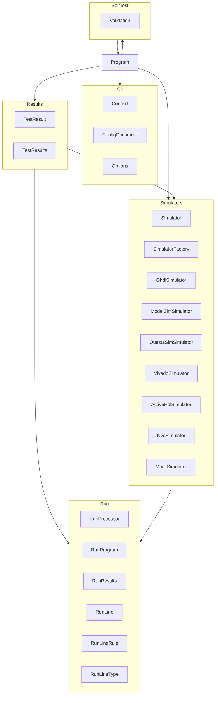

# VHDLTest

VHDLTest is a .NET command-line tool that accepts command-line arguments, loads a YAML configuration file,
invokes a VHDL simulator, processes the simulation output, and reports test pass/fail results.

## Architecture

VHDLTest is structured as a single system containing five subsystems and one top-level unit. The `Program`
unit is the sole entry point and orchestrates all subsystems. The one exception is `Validation` (in the
`SelfTest` subsystem), which calls back into `Program.Run` in-process as a re-entrant call to execute each
embedded validation test scenario; this is the only circular dependency in the design.

## External Interfaces

**Command-Line Interface**: Arguments and options passed to the tool on invocation.

- *Type*: CLI
- *Role*: Consumer (the operator invokes this tool)
- *Contract*: Accepts options `-h/--help`, `-v/--version`, `--validate`, `--silent`, `--verbose`,
  `--depth`, `-l/--log`, `-c/--config`, `-r/--result/--results`, `-s/--simulator`, `-0/--exit-0`,
  and a positional test-filter list. Accepted values for `--simulator`: `ghdl`, `nvc`, `modelsim`,
  `questasim`, `vivado`, `activehdl`, `mock`. Test-filter names are supplied as positional arguments
  after all options or after a `--` separator. Writes results and diagnostics to stdout/stderr.
- *Constraints*: Unknown options cause an error; missing config file causes an error and prints usage.

**Configuration File**: YAML file specifying simulator settings and test list.

- *Type*: File (YAML)
- *Role*: Consumer (reads file from disk)
- *Contract*: Parsed by `ConfigDocument` into an `Options` instance; fields include compile files
  (`files`) and test bench entity names (`tests`).
- *Constraints*: File must be valid YAML conforming to the VHDLTest configuration schema.

**Environment Variables**: Simulator executable path overrides.

- *Type*: Environment variables
- *Role*: Consumer (reads process environment)
- *Contract*: Variables following the `VHDLTEST_<SIMULATOR>_PATH` naming convention override
  default simulator path discovery for the named simulator.
- *Constraints*: Optional. When set, the value must be the full path to the directory containing
  the simulator executable.

**Simulator Process**: External VHDL simulator executable invoked as a child process.

- *Type*: Process (stdin/stdout/stderr pipes)
- *Role*: Consumer (spawns and reads output from the simulator)
- *Contract*: Each simulator subclass (`GhdlSimulator`, `NvcSimulator`, etc.) constructs the
  appropriate command-line arguments and interprets stdout/stderr via `RunProcessor` rules to
  classify each output line as pass, fail, or informational.
- *Constraints*: Simulator must be installed and on the system PATH. Exit codes and output format
  are simulator-specific and handled per-subclass.

**Results File**: Optional TRX or JUnit XML file written on completion.

- *Type*: File (TRX/JUnit XML)
- *Role*: Provider (writes file to disk)
- *Contract*: Written by `TestResults.SaveResults` using the `DemaConsulting.TestResults` library.
  Path specified via `--results` option.
- *Constraints*: Format is determined by file extension (.trx → TRX, .xml → JUnit).

## Dependencies

- **YamlDotNet**: used for YAML deserialization of the configuration file — see *YamlDotNet
  Integration Design*
- **DemaConsulting.TestResults**: used for writing TRX and JUnit test results files — see
  *DemaConsulting.TestResults Integration Design*

## Risk Control Measures

N/A - not a safety-classified software item.

## Data Flow

Data moves through VHDLTest in the following sequence:

1. `Program.Main` receives raw command-line arguments and creates a `Context` (Cli subsystem).
2. `Program.Run` inspects `Context` flags; for a test run it calls `SimulatorFactory.Get` to
   select the active simulator (Simulators subsystem).
3. `Options.Parse` calls `ConfigDocument.ReadFile` to deserialize the YAML configuration file into a
   `ConfigDocument` instance (using YamlDotNet), then constructs an `Options` record (Cli subsystem).
4. `TestResults.Execute` calls `simulator.Compile` to build the VHDL sources in the order they are
   declared in the configuration file; if compilation produces an Error-severity result, execution
   halts with `InvalidOperationException("Build Failed")`.
5. On build success, `TestResults.Execute` iterates over the configured tests; for each test it
   delegates to the active simulator which invokes `RunProgram` to spawn the simulator process and
   `RunProcessor` to classify each output line (Run subsystem). Each classified line is accumulated
   into `RunResults`, from which pass/fail `TestResult` records are created and collected into
   `TestResults` (Results subsystem).
6. `TestResults.PrintSummary` writes the summary to the `Context` output stream.
7. If a results file path is present, `TestResults.SaveResults` writes the TRX or JUnit file.
8. `Program.Main` sets `Environment.ExitCode` from `context.ExitCode`. When `--exit-0` is
   active, `Context.ExitCode` always reports 0 regardless of test failures, so the exit
   code written to `Environment.ExitCode` is always 0 in that mode.

### Self-Validation Data Flow (`--validate`)

When `--validate` is specified, data flows through a re-entrant self-test path:

1. `Program.Main` receives `--validate` and creates a `Context` (Cli subsystem).
2. `Program.Run` detects `Context.Validate` and delegates to `Validation.Run` (SelfTest
   subsystem) instead of the normal test path.
3. `Validation.Run` iterates over its embedded test scenarios (VHDLTest_TestPasses,
   VHDLTest_TestFails); for each scenario it calls back into `Program.Run` in-process
   with a freshly created Context using the simulator name from the outer invocation
   (pass `--simulator mock` to use the built-in mock simulator).
4. Each re-entrant `Program.Run` call follows the normal 8-step data flow above using
   `MockSimulator` in place of a real simulator.
5. `Validation` collects the per-scenario `RunResults`, formats a Markdown validation
   report at the configured heading depth — including system information (VHDLTest Version,
   Machine Name, OS Version, DotNet Runtime, and Time Stamp) — and writes it to the `Context` output stream.
6. If a results file path is present (`--results`), `TestResults.SaveResults` writes the
   validation report to the specified file (TRX or JUnit format, determined by extension),
   in addition to the output stream write in step 5.
7. `Program.Main` sets `Environment.ExitCode` from the aggregate validation result.

## Design Constraints

- **Platform**: targets .NET 8, .NET 9, and .NET 10 on Linux, Windows, and macOS.
- **Distribution**: packaged and distributed as a .NET global tool (`dotnet tool install`).
- **Simulator coupling**: each simulator integration is self-contained in its own unit; adding a
  new simulator requires only a new subclass registered in `SimulatorFactory`.
- **No unsafe code**: all code must compile without unsafe blocks; pointer arithmetic is prohibited.
- **Nullable reference types**: enabled throughout; all public APIs must be null-annotated.

## Error Handling

| Error Condition | Detection | Response |
| --- | --- | --- |
| Compilation error | Error-severity result from Compile | `InvalidOperationException` thrown; exits non-zero |
| Unknown CLI option | `Context.Create` encounters unknown flag | Writes error and usage; exits non-zero |
| Missing config file path | `Context.ConfigFile` is null | Writes "Error: Missing arguments"; exits non-zero |
| Missing config file on disk | `ReadFile` throws `FileNotFoundException` | Writes error; exits non-zero |
| Invalid configuration YAML | `ReadFile` throws `InvalidOperationException` | Writes error; exits non-zero |
| Unknown simulator name | `SimulatorFactory.Get` returns null | Throws "Simulator not found"; exits non-zero |
| Simulator executable absent | `Compile`/`Test` throws `InvalidOperationException` | Writes error; exits non-zero |
| Results file write failure | `TestResults.SaveResults` throws exception | Writes error; exits non-zero |

**Note**: All console error output (produced via `Context.WriteError`) is suppressed when
`--silent` is active. Log-file output to the `--log` file is unaffected by `--silent` mode.
