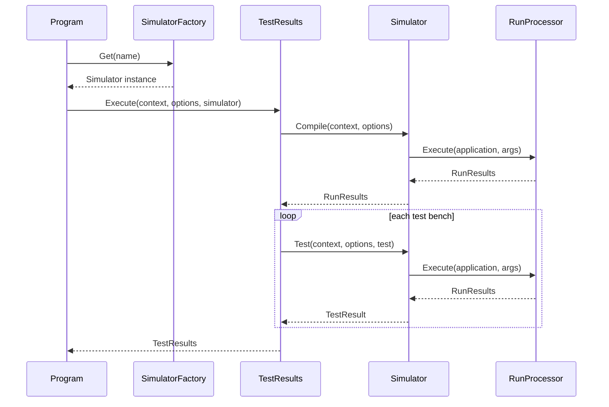

## Simulators

### Overview

The Simulators subsystem provides VHDL simulator integration for the VHDLTest system. It encapsulates all
concerns of invoking external simulator tools: path discovery, script generation, process execution, and
output classification. The subsystem defines an abstract `Simulator` base class that establishes the compile
and test contracts, and a `SimulatorFactory` that maps simulator name strings to concrete singleton instances.
Six production simulator classes implement the base class for GHDL, NVC, ModelSim, QuestaSim, Vivado, and
Active-HDL. A `MockSimulator` provides a deterministic in-process test double used for self-validation. The
subsystem boundary is the `Simulator` public API; no other subsystem invokes simulator tools directly.

Contained units: Simulator, SimulatorFactory, GhdlSimulator, NvcSimulator, ModelSimSimulator,
QuestaSimSimulator, VivadoSimulator, ActiveHdlSimulator, MockSimulator.

### Interfaces

**SimulatorFactory.Get**: Public static factory method for obtaining a simulator instance by name.

- *Type*: In-process .NET public API.
- *Role*: Provider.
- *Contract*: `Simulator? Get(string? name)` returns the `Simulator` whose `SimulatorName` matches the
  supplied name (case-insensitive), or the first `Available()` simulator when name is null. Returns
  `MockSimulator` for name "mock". Returns null for an unknown or unavailable name.
- *Constraints*: The caller must handle a null return, typically by throwing a descriptive exception.

**Simulator.Compile**: Abstract method contract for VHDL source file compilation.

- *Type*: In-process .NET public API.
- *Role*: Provider.
- *Contract*: `RunResults Compile(Context context, Options options)` compiles all VHDL files listed in
  `options.Config.Files` using the underlying simulator and returns classified output.
- *Constraints*: Throws `InvalidOperationException` when the simulator is not installed (SimulatorPath is null).

**Simulator.Test**: Abstract method contract for executing a VHDL test bench.

- *Type*: In-process .NET public API.
- *Role*: Provider.
- *Contract*: `TestResult Test(Context context, Options options, string test)` runs the named test bench
  and returns pass/fail status with diagnostic output.
- *Constraints*: Throws `InvalidOperationException` when the simulator is not installed (SimulatorPath is null).

**Run Subsystem**: Process execution and output classification.

- *Type*: In-process .NET internal API.
- *Role*: Consumer.
- *Contract*: `RunProcessor.Execute` launches external processes and classifies output lines into severity
  categories (Info, Warning, Error) using `RunLineRule` patterns.
- *Constraints*: None.

**Results Subsystem**: Structured test and compile outcome types.

- *Type*: In-process .NET internal API.
- *Role*: Consumer.
- *Contract*: `RunResults` and `TestResult` carry pass/fail status and diagnostic lines.
- *Constraints*: None.

**Cli Subsystem**: Context and configuration types.

- *Type*: In-process .NET internal API.
- *Role*: Consumer.
- *Contract*: `Context` provides verbose-log output; `Options` carries parsed configuration including the
  VHDL file list and working directory.
- *Constraints*: None.

### Design

The factory selection and invocation flow is:

1. `Program` reads the simulator name from the run configuration and calls `SimulatorFactory.Get(name)`.
2. `SimulatorFactory.Get` returns `MockSimulator.Instance` for the name "mock", searches the `Simulators`
   array by name (case-insensitive) for any other non-null name, or returns the first `Available()`
   simulator when name is null.
3. `Program` passes the selected simulator to `TestResults.Execute`, which calls `Compile` once per run
   and `Test` once per configured test bench.
4. Each simulator delegates external process execution and output classification to the Run subsystem.

Each production simulator's `Compile` and `Test` methods follow this pattern:

1. Verify `SimulatorPath` is non-null; throw `InvalidOperationException` otherwise.
2. Create or ensure the simulator-specific working directory under `VHDLTest.out/{SimulatorName}/`.
3. Generate a script file (response file or TCL `.do` file) containing the compile or simulation commands.
4. Invoke `RunProcessor.Execute` to launch the simulator executable with the script, capturing and
   classifying output.
5. Return `RunResults` or wrap it in a `TestResult`.

`MockSimulator` does not invoke any external process: it generates synthetic output in-process by inspecting
file names and test bench names for embedded severity keywords (`_error_`, `_warning_`, `_fail_`, etc.).

